# Art Gallery Web App - C4 Architecture

**Date:** 2026-04-30
**Status:** Draft companion architecture doc
**Source spec:** [2026-04-30-art-gallery-design.md](./2026-04-30-art-gallery-design.md)

This document describes the v1 architecture using the first three C4 model layers only:

- **Level 1 - System Context:** who uses the product and which external systems it depends on.
- **Level 2 - Containers:** deployable/runtime parts of the system and how they communicate.
- **Level 3 - Components:** major components inside the Next.js app, Go API, and Cloudflare image gateway.

The C4 code level is intentionally omitted.

## Level 1 - System Context

The Art Gallery Web App lets anonymous visitors browse public artwork and lets authenticated artists manage their own artwork, including private works. Image bytes are served outside the app/API path through a Cloudflare Worker image gateway so the browsing experience stays smooth under many image requests.

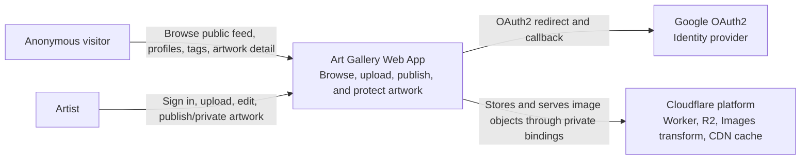

### External Actors

| Actor | Goal |
|---|---|
| Anonymous visitor | Browse public artwork without signing in, open artwork detail pages, inspect full display-resolution images, visit artist and tag pages. |
| Artist | Sign in with Google, upload multi-image artwork, edit profile/artwork metadata, publish artwork, make artwork private, view their own private works. |
| Google OAuth2 | Authenticates artists and returns profile identity used to create or find a user account. |
| Cloudflare platform | Hosts the image gateway, stores source images in R2, transforms images on demand, and caches public transformed images. |

## Level 2 - Containers

The system is split so HTML/API data and image bytes use different runtime paths. The Go API owns business rules and metadata. The Cloudflare Worker owns image access, transformations, and cache headers.

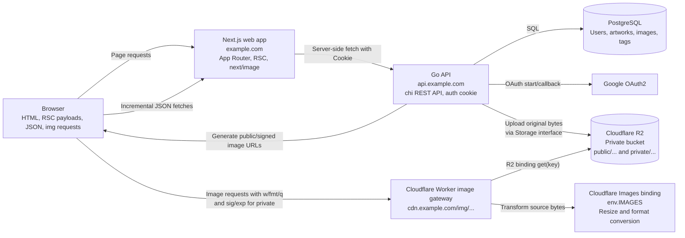

### Container Responsibilities

| Container | Responsibilities | Must Not Do |
|---|---|---|
| Browser | Render gallery UI, request pages/data, request transformed image URLs directly from the Worker. | Store JWTs in localStorage; proxy image bytes through Next.js or Go. |
| Next.js web app | SSR/RSC pages, public feed UI, upload/profile/settings UI, cache-safe rendering rules for private surfaces. | Make authorization decisions independently of the Go API. |
| Go API | OAuth flow, session cookie, ownership checks, artwork metadata, upload validation, privacy changes, signed private image URL generation. | Serve image bytes to browsers. |
| PostgreSQL | Durable metadata for users, artwork, image records, tags, visibility, publish lifecycle. | Store original image bytes. |
| Cloudflare Worker image gateway | Single chokepoint for browser image access, HMAC validation for private paths, R2 reads, image transforms, public/private cache headers. | Trust cookies for image access; serve private image bytes before signature validation. |
| Cloudflare R2 | Private object storage for original JPG/PNG uploads. | Be publicly readable. |
| Cloudflare Images binding | On-demand resize and format conversion from Worker-provided source bytes. | Decide authorization. |

## Level 3 - Components

### Next.js Web App Components

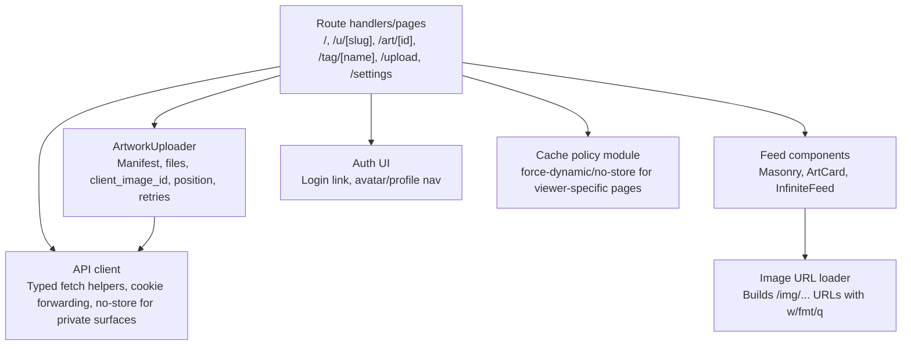

| Component | Responsibility |
|---|---|
| Route handlers/pages | Render public feed, artwork detail, artist profile, tag page, upload, and settings routes. |
| API client | Calls the Go API, forwards cookies during SSR, uses `cache: 'no-store'` for viewer-specific or signed-URL responses. |
| Feed components | Render masonry feed, preserve aspect ratios, show blur placeholders, append pages through intersection observer. |
| ArtworkUploader | Builds upload manifest, assigns per-file `client_image_id` and `position`, retries failed files safely. |
| Image URL loader | Adds transform params (`w`, `fmt`, `q`) to Worker image URLs without signing anything in the browser. |
| Cache policy module | Enforces dynamic/no-store behavior for `/u/[slug]`, `/art/[id]`, `/upload`, and `/settings`. |

### Go API Components

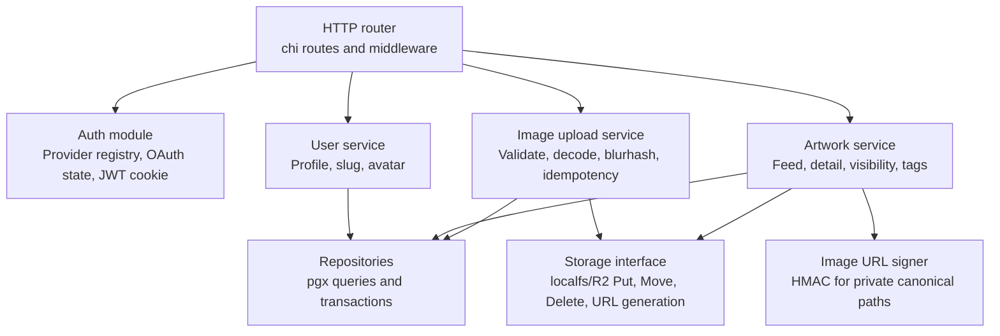

| Component | Responsibility |
|---|---|
| HTTP router | Maps REST endpoints, applies auth middleware, translates errors to HTTP status codes. |
| Auth module | Handles `/auth/{provider}/start`, `/auth/{provider}/callback`, provider registration, state validation, JWT issue/verify. |
| User service | Creates/upserts users from OAuth profiles, manages display name, slug, and avatar. |
| Artwork service | Applies visibility rules, feed/profile/tag filtering, publish lifecycle, private/public flips. |
| Image upload service | Owns multipart manifest processing, size/type validation, image decode, blurhash, per-file idempotency. |
| Storage interface | Hides local filesystem vs R2, supports original object writes, moves, deletes, and URL construction. |
| Repositories | Execute SQL using real PostgreSQL schema and transactions. |
| Image URL signer | Creates signed private origin URLs using canonical string `v1|/private/<storage_key>|<exp>`. |

### Cloudflare Worker Image Gateway Components

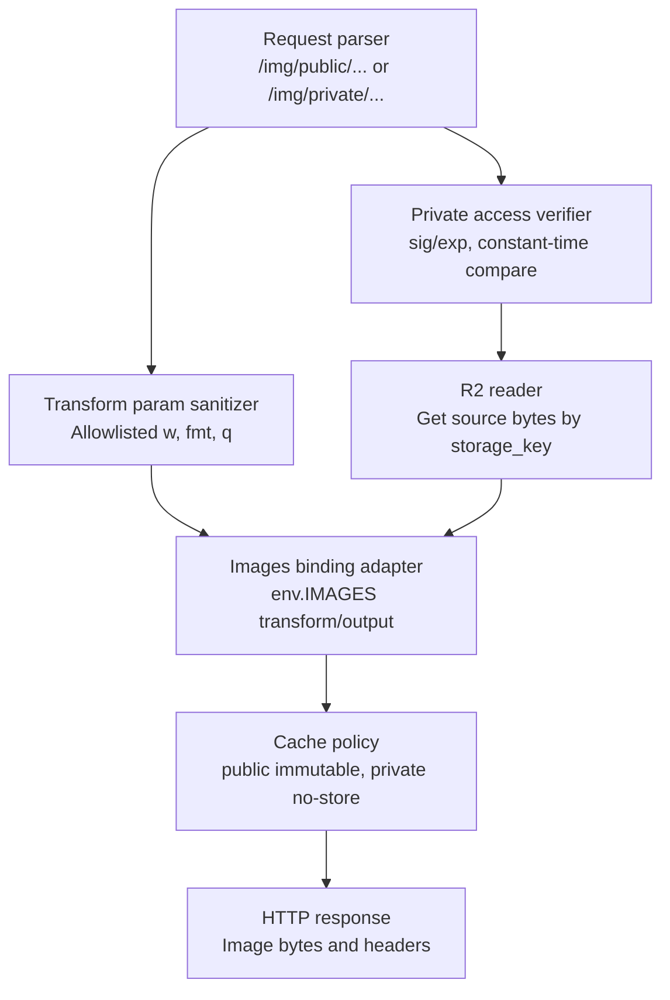

| Component | Responsibility |
|---|---|
| Request parser | Converts `/img/<storage_key>` into an R2 key and rejects path traversal or unsupported prefixes. |
| Transform param sanitizer | Allows only safe widths/formats/qualities; clamps or rejects unsupported values. |
| Private access verifier | Requires valid `sig` and future `exp` before any R2 read for `/img/private/...`. |
| R2 reader | Reads original source bytes through the private R2 binding. |
| Images binding adapter | Applies resize and output format conversion using `env.IMAGES`. |
| Cache policy | Public images may be cached aggressively; private images return `Cache-Control: private, no-store`. |

## Use Case Diagrams

### UC1 - Anonymous Browses Public Feed

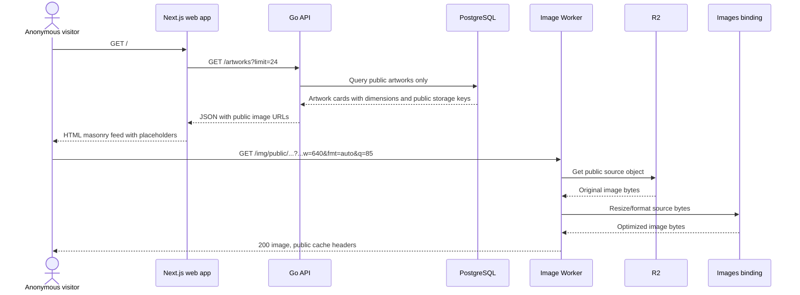

### UC2 - Anonymous Opens Artwork Detail

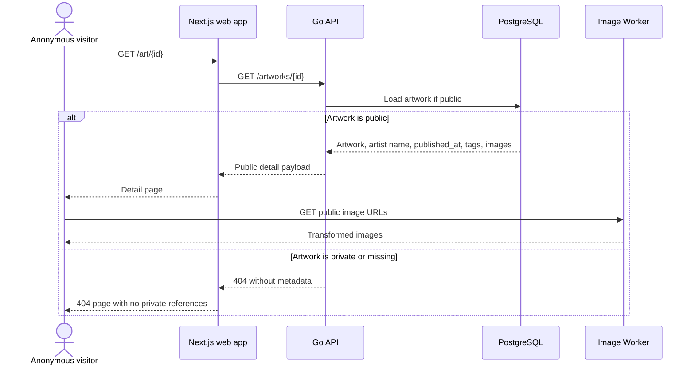

### UC3 - Artist Signs In With Google

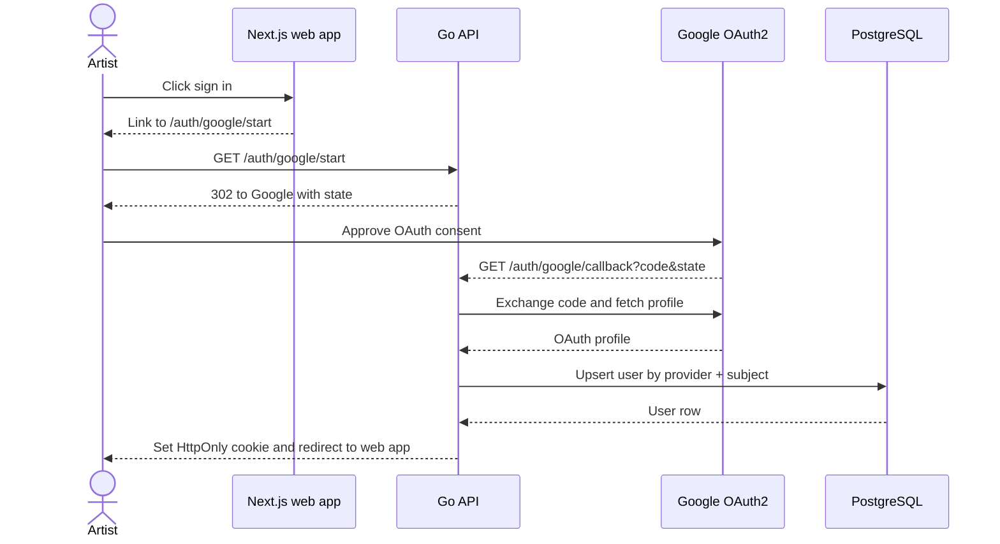

### UC4 - Artist Uploads Multi-Image Artwork

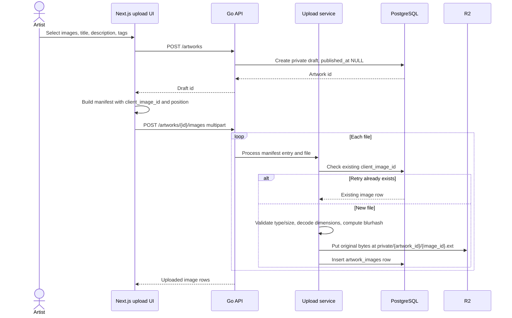

### UC5 - Artist Publishes Artwork

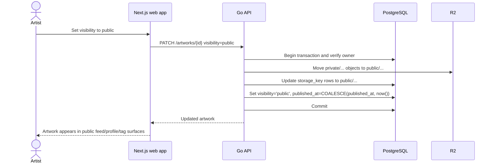

### UC6 - Artist Makes Artwork Private

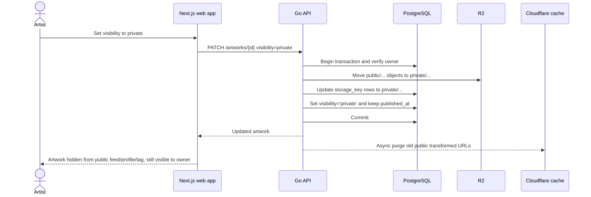

### UC7 - Owner Views Private Artwork

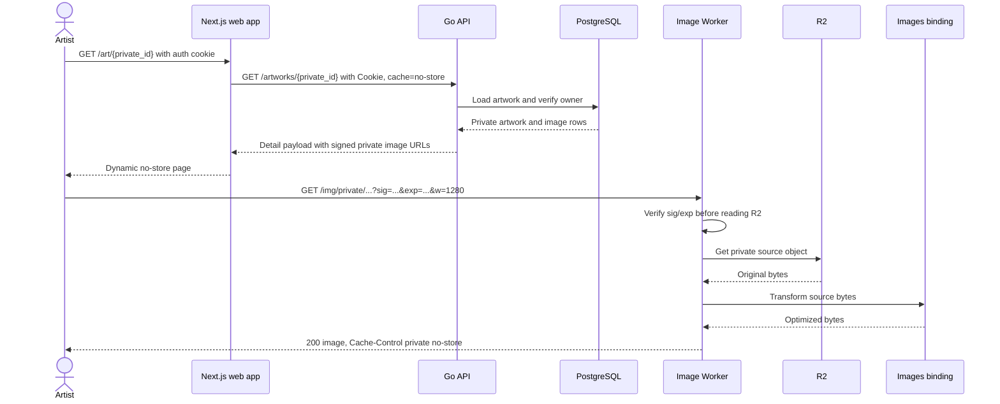

### UC8 - Non-Owner Attempts Private Artwork

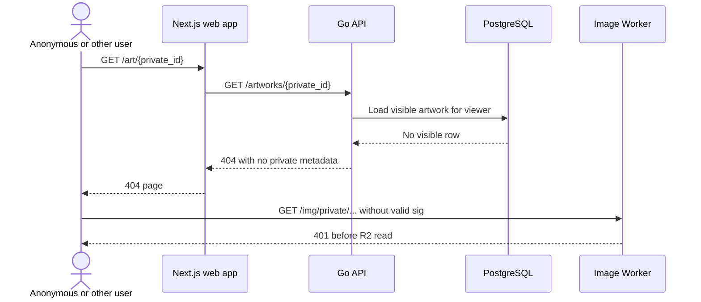

### UC9 - Artist Profile and Tag Browsing

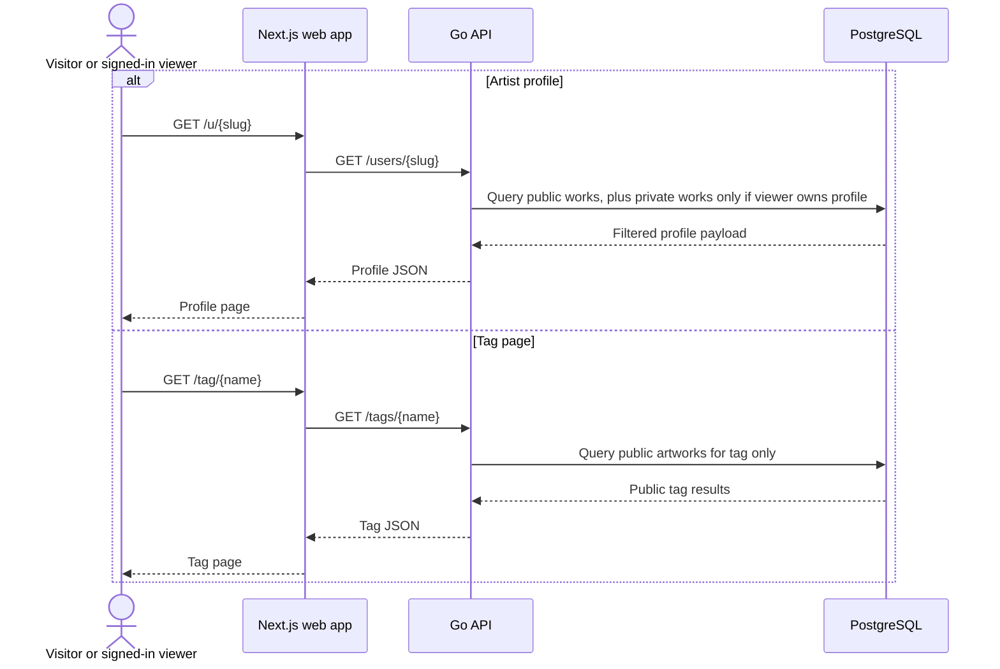

## Cross-Cutting Rules

### Privacy

- Public list surfaces must filter to `visibility='public' AND published_at IS NOT NULL`.
- Owner-only surfaces must be dynamic and `no-store`.
- Private image URLs must contain short-lived `sig` and `exp`.
- The Worker must validate private signatures before reading R2.
- Private transformed responses must be `Cache-Control: private, no-store`.
- Anonymous and non-owner responses must not include private IDs, private paths, signed URLs, or private metadata.

### Performance

- The API and Next.js never proxy image bytes.
- Image cards always include width/height so the masonry layout reserves space before bytes arrive.
- Public transformed images may be cached aggressively by Cloudflare.
- Private transformed images are not shared-cacheable; privacy takes priority over CDN reuse.
- Infinite scroll appends cursor-paginated JSON and must not duplicate artwork IDs.

### Test Mapping

| Use case | Primary tests |
|---|---|
| UC1 public feed | Privacy matrix case 1, SSR case 6, UX cases 21-23. |
| UC2 detail page | Privacy matrix cases 2, 3, and 9. |
| UC3 sign in | Auth tests for OAuth callback, state validation, cookie attributes. |
| UC4 upload | Upload idempotency cases 16-19. |
| UC5 publish | Publish lifecycle case 20 and feed/profile/tag visibility checks. |
| UC6 private flip | Privacy matrix, CDN purge E2E, incognito disappearance case 24. |
| UC7 owner private view | Privacy matrix cases 2, 7, 12, 13. |
| UC8 non-owner private denial | Privacy matrix cases 2, 9, 11, 14. |
| UC9 profile/tag browse | Privacy matrix cases 4, 5, 7, 8. |
